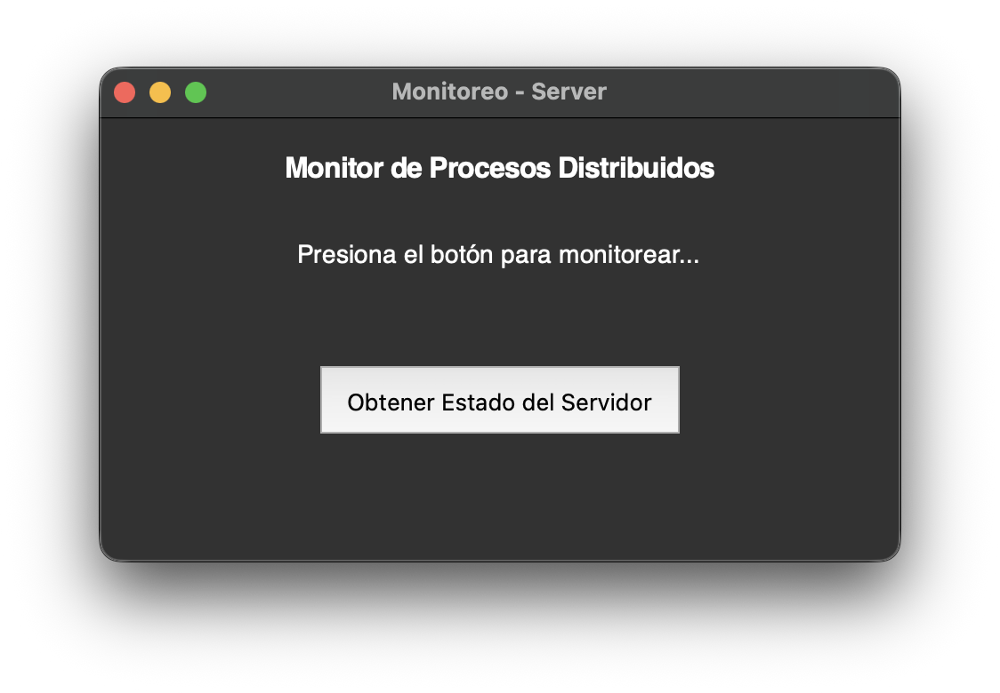
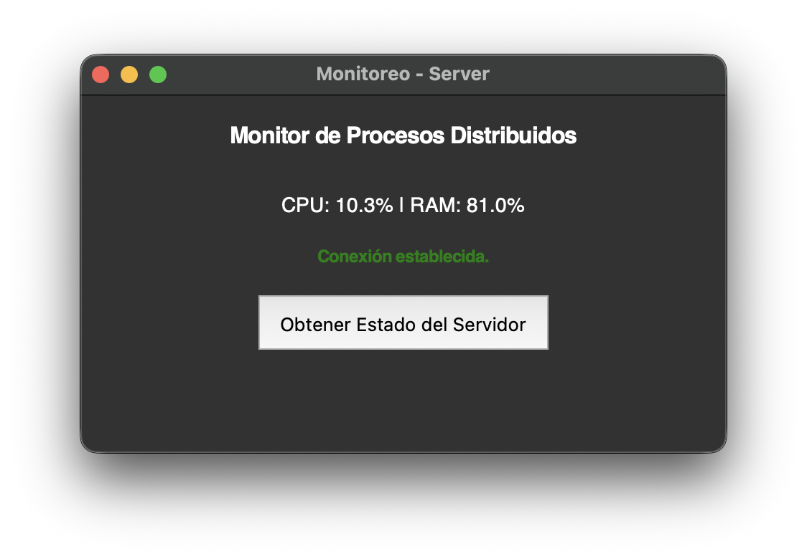

# Conexión Cliente-Servidor

## Requisitos previos:
- **Python 3** instalado.
- Librería `psutil` para la recolección de datos (CPU y RAM en este caso):

**Bash**
```bash
pip install psutil
```
**Powershell** (si no reconoce 'pip')
```Powershell
python -m pip install psutil
```

## Tutorial de como lograr conectarse al servidor para obtener información del mismo.

**1. Generar llaves**

En la terminal y dentro de el mismo directorio donde se encuentran los códigos pondremos este comando:

```bash
openssl req -x509 -newkey rsa:4096 -keyout server.key -out server.crt -sha256 -days 365 -nodes
```
.
En los datos que pide se puede poner lo que sea o simplemente dar enter a todo, no es relevante para este caso.

Para generar una llave a otro servidor simplemente cambiamos '-keyout server.key' y '-out server.crt' por lo que se ponga en esta parte del código:

```python
def main():
    context = ssl.create_default_context(ssl.Purpose.CLIENT_AUTH)
    try:
        context.load_cert_chain(certfile="server.crt", keyfile="server.key") # Aquí
```

**2. Configurar cliente**

Para configurar el cliente lo unico que debemos hacer es cambiar 'HOST = 0.0.0.0' a la dirección ip que se especifique en la presentación.

```python
HOST = '0.0.0.0'
PORT = 5555
AUTH_TOKEN = "clave123"
```

**3. Ejecución** 

En la terminal, dentro del directorio donde guardaste los archivos '.py' vas a ingresar:
```bash
python3 cliente.py
```

Esto abrirá la siguiente ventana:

Ahora es simplemente darle click al botón para que se conecte al servidor y deberá mostrarte los siguientes datos
